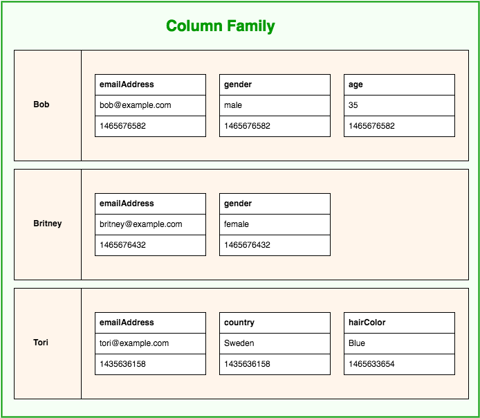

---

title: Week 4
draft: false
tags:
  - college
  - computer science
  - fourth semester
  - data
  - data modelling

---

# Benchmarking RDBMS vs NoSQL

> 

> 

## RDBMS

RDBMS not fast enough although there is materiallized view, join is the problem. The need of read and write data, scalability, dinamika struktur yang berbeda/fleksibelitas struktur(vertikal/horizontal)/bagaimana kita mengextend pengembangan kapasitas.:

Vertikal/scale up:
MEngembangkan kemampuan server di fisik yang sama

Horizontal/scale out:
Banyak server yang bekerja bersama(ex. per region). 

RDBMS traditional is good for vertical scaling, sedangkan NoSQL is good for horizontal scaling. This is fundamental for NoSQL to be chosen by scalability for modern app.

RDBMS Schema ketat, dalam organization startup can be bottleneck for development velocity

## NoSQL

Schemaless, no need structure.

* document can be different structure
* add field can be anytime
* there is no downtime
* fast development

BASE(Almost opposite of ACID):

* Basically available, nodes  go down but whole system shouldnt be affected
* Soft state(scalable),  state ssytem exchange overtime
* Eventual Consistency, given enough time

CAP:

quartz/content/Semsester 4/Data Modelling/cap.png

NoSQL(Collection(Documents(Fields)))

### 4 Categories:

**1. Key Values Store**

Store data as key-value

caching, session
fastest O(1)

Digunakan ketika memerlukan akses data yang sangat cepat dengan access pattern

> Very good for situation that only need one primary key access to get data

**2. Column Familiy**

banyak baris dimana satu baris mengandung banyak kolom, like sparse matrixx

setiap baris dapat memeiliki banyak kolom berbeda(unlimited columns per row)

time series, logs
fast for analytics

**3. Documents**

CMS, e-commerce
fast for queries

schema less ofc, nested objects, arrays support, rich query language

json

mongoDB

Agregat dan Denormalisasi:

* embedding(denormalisasi), 
* referencing(rnormalisasi)

**4. Graph**

social networks, reccomendations
fast for traversal

#

Jangan terpaku pada satu kategori, gunakan polyglot persistence, 

postgre transactional

redis caching

elasticsearch search

neo4j recommendation