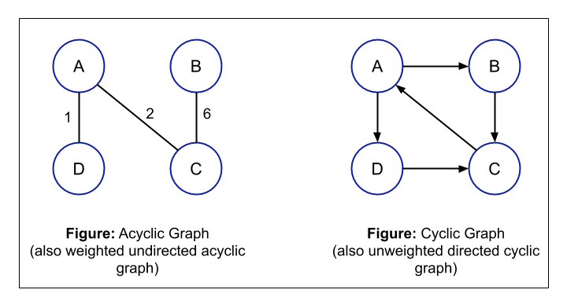
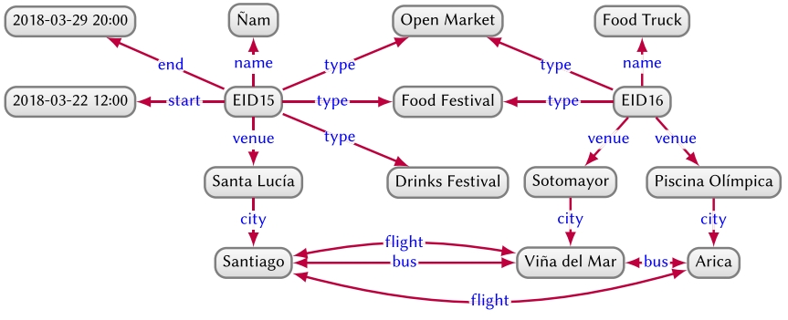
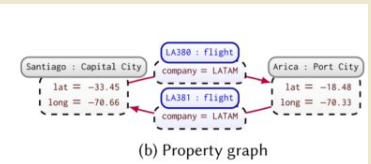

---

title: Week 5
draft: false
tags:
  - college
  - computer science
  - fourth semester
  - data
  - data modelling
  - graph
  - database

---

# Graph Database

> Untuk mendapat reelasi antar data yang bervariasi

> Kriteria seleksi: mempertimbangkan infrastruktur data existing, kebutuhan perfroma, karakteristik workload, budget, dan lisensi.

## Tantangan umum
- data quality dan consistency
- perubahan mindset
- integrasi dengan sistem yang sudah ada
- keahlian teknis

## Best practice

## Strategi migrasi data

## DAtabase graoh native

## Database graoh non native

## Karakteristik kunci

## Bahasa Query Cypher

## Use Case

# Graph Ditected Acyclic(DAG)

berarah tanpa ada siklus. Tidak ada jalur yang dimulai dan berakhir pada vertex yang sama

## Properti kunci

- memungkinkan

## Model triple RDF

data direpresentasikan sebagai(subject, predicate, object). Ex. (Alice, known bob) atau (noodles, hasPrice, 99.99)

## Perbandingan dengan property graph

RDF: struktur lebih kaku, lebih baik untuk semantik web. PRoperty graph: lebih fleksibel, lebih baik untuk sistem operasional

# Knowledge graph

adalah pengetahuan eksplisit

## Heterogeneous graph DEL(DIrected Edge LAbel)

kumpulan node dan sebuah set edge berlabel yang berarah iantara node tersebut.

https://realkm.com/2023/03/27/introduction-to-knowledge-graphs-section-3-1-data-graphs-models/

## Property Graph

- directed
- vertex-labelled
- edge-labelled
- multi-graph
- with self-loops
- with sets of attribute-value pairs

terdiri dari satu set pasangan properti-nilai dan label untuk dikaitkan dengan node dan edge, 

## Further more

https://afteracademy.com/article/introduction-to-graph-in-programming